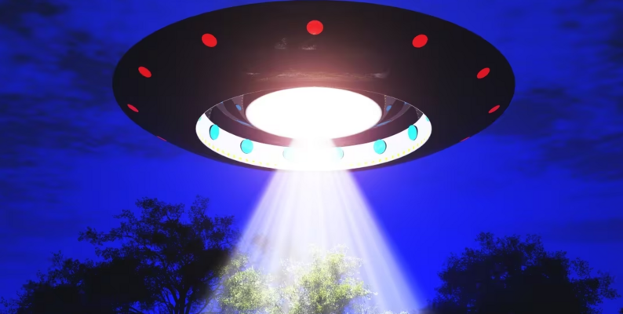
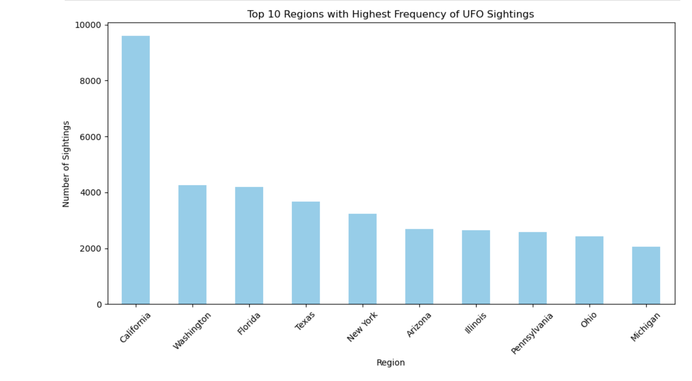
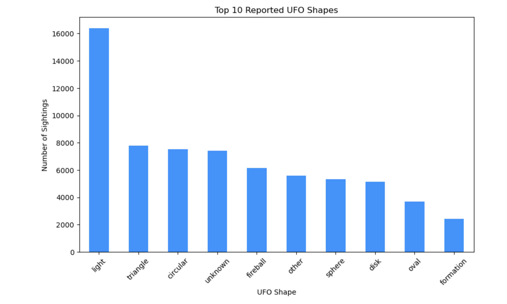
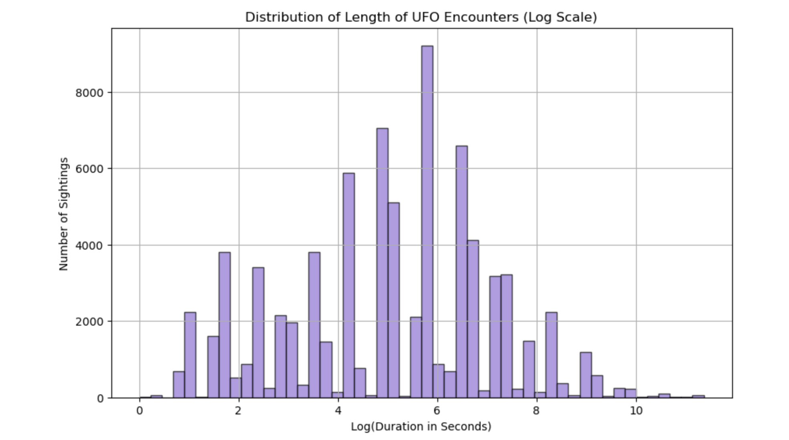
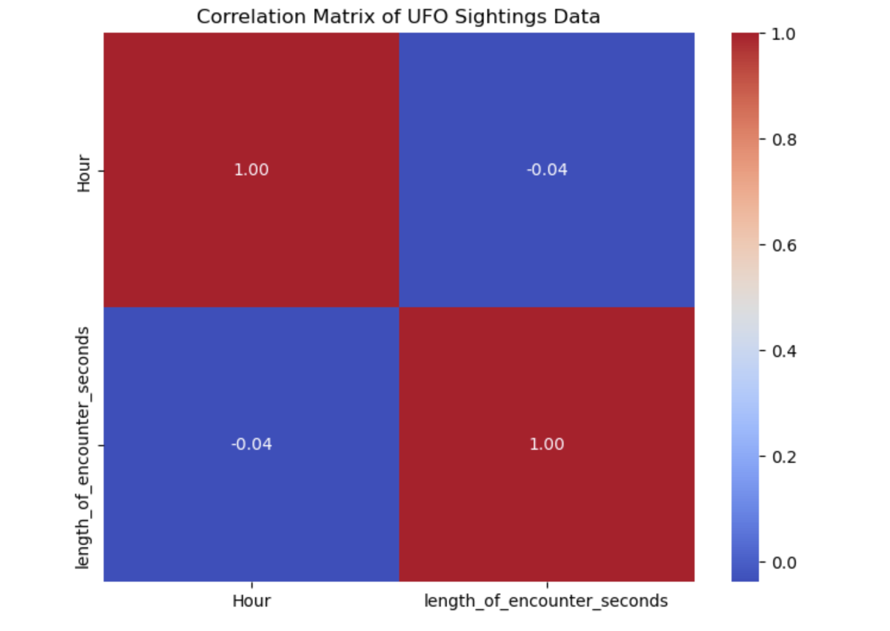

# National UFO Reporting Center Data Analysis

## Overview

This project analyzes UFO sighting data collected by the National UFO Reporting Center (NUFORC), which has recorded over 80,000 reports from 1949 to 2013. By conducting a descriptive analysis of sighting locations, timings, and characteristics, we aim to uncover patterns and trends in UFO sightings. Our analysis explores key questions such as the most commonly reported UFO shapes, the times and places where sightings are most frequent, and whether any correlations exist between the time of sighting and the likelihood of a UFO encounter.

## Business Problem 


By identifying patterns in UFO sightings, the National UFO Reporting Center can enhance its ability to communicate findings to researchers, enthusiasts, and governmental entities. Providing clear, data-driven visualizations of UFO sighting frequencies, shapes, and encounter characteristics will improve the understanding of these phenomena. This, in turn, will support strategic decisions related to future research, public education, and potential resource allocation for investigating UFO encounters.

## Data Understanding 

The dataset contains detailed information on UFO sightings reported globally. It includes key features like the date and time of the sighting, geographic information (country, region, and locale), descriptions of the UFO (shape and encounter duration), and other attributes that can be used for exploratory data analysis and predictive modeling.
Given the diverse nature of this dataset, we will focus on cleaning and processing the data to answer three key business questions:

1. What regions and times have the highest frequency of UFO sightings?
     - We will use the Country, Region, Locale, Year, Month, Hour, and Season columns to find the hotspots for UFO activity.
2. Are there notable patterns in UFO shapes, descriptions, or lengths of encounters?
     - The columns UFO_shape, length_of_encounter_seconds, and Description will be analyzed to explore common shapes, durations, and narratives in the reported encounters.
3. Can any correlations be drawn between the timing (season, time of day) and the likelihood of a sighting?
     - We will explore correlations between the Season, Month, Hour, and length_of_encounter_seconds to see if UFO sightings show patterns based on the time of day or season of the year.

## Data Preparation

This project applies descriptive analysis to understand patterns in UFO sightings, utilizing visualizations to examine trends over time, geographic hotspots, and sighting characteristics such as shape and encounter duration. Correlation analysis was also conducted to investigate potential relationships between the timing of sightings and their duration.


## Analysis & Results

Geographic Trends: The United States, particularly California, has the highest number of reported UFO sightings, followed by Washington and Florida. Sightings are most frequent during the summer months, peaking in July.



Sighting Characteristics: The most commonly reported UFO shape is "light," followed by "triangle" and "circular." Most sightings are brief, with a median encounter length of 180 seconds.





Time-Based Correlations: There is a weak negative correlation (-0.04) between the length of sightings and the time of day, suggesting little connection between sighting duration and the hour of occurrence.



## Conclusions

- **UFO Sightings by Region and Time**:  
  The United States, especially California, leads in UFO sightings by a significant margin. Sightings peak during the summer months, particularly in July and August, and are more frequent in coastal and densely populated areas. The trend over the years shows a rise in sightings after 2010, with a peak in 2012, followed by a decline.

- **Patterns in UFO Shapes and Descriptions**:  
  The most commonly reported UFO shape is "light," followed by "triangle" and "circular" forms. The descriptions often include terms like "light," "moving," and "sky." The distribution of the length of encounters suggests most sightings are brief, with a median duration of around 180 seconds.

- **Correlation Between Timing and Sightings**:  
  There is no strong correlation between the time of day (hour) and the duration of encounters, with a weak negative correlation (-0.04). This suggests that while there may be certain times with more sightings, the length of these encounters does not significantly vary based on the time.

### **Additional Insights & Recommendations**


- **High Sightings in Certain Regions and at Specific Times of Year**:  
  For Tourism Agencies: Create "UFO Tourism Trails" in these high-sighting regions (e.g., California, Washington) with seasonal promotions for autumn and summer. Collaborate with local businesses to offer guided tours during the peak times in the evening (8 p.m. - midnight), focusing on open-sky locations for better visibility.

  For Travel Companies: Design travel packages that include nighttime skywatching experiences in the top sighting regions during the peak months. Add complementary activities like camping, storytelling around sightings, and expert-led UFO talks to enhance the experience.

- **Commonly Reported Shapes and Their Impact on Tourist Experience**:  
  For Local Communities: Develop attractions themed around these popular shapes. For example, in regions with a high frequency of "Light" sightings, organize "Light Festivals" featuring sky illuminations, light installations, and educational activities on UFO phenomena.

  For Travel Companies: Create different packages based on shape experiences. "Quick Flash Skywatching" could focus on shorter sightings like "lights" or "circles" with sky-gazing and light shows, while "Deep Sky Mystery Tours" could emphasize longer sightings like "triangles" and "discs," including time for discussions about the sighting descriptions and more in-depth nighttime exploration.

- **Regions with Longer Average Encounter Durations as Key Destinations**:  
  For Tourism Agencies & Local Governments: Identify and promote these regions (e.g., states within the U.S. or countries like the UK) as top destinations for in-depth UFO experiences. Create "Extended Sighting Zones" where tourists can experience longer skywatching periods, complete with telescopes, night-vision equipment, and comfortable seating areas.

  For Marketing Teams: Use the unique appeal of these long-duration encounters in advertising campaigns: "Experience the Longest-Lasting UFO Sightings." Highlight local testimonials and stories to enhance the sense of mystery and anticipation for tourists.

- **Emotional Tone of Sightings and Its Connection to Tourist Experience**:  
  For Travel Companies: Design tours that cater to different emotional experiences: "Wonder in the Sky" Tours: Focus on long, positive encounters, offering relaxing, awe-inspiring experiences with ambient music, guided sky-gazing, and educational elements.

  "Thrills and Chills Night" Experiences: Leverage sightings described as "scary" or "strange" to create thrill-based tours, including night hikes, scary storytelling, and "mystery" themes to keep tourists on edge.

  For Tour Guides & Educators: Craft narratives around the emotional content of sightings. For sightings with positive sentiments, build a hopeful, awe-inspired story. For sightings with negative sentiment, create suspenseful, thrilling narratives to heighten the tourist experience.

  ### **Overall Strategic Enhancements**

- Target Key Regions & Timing: Focus on the U.S., especially states like California and Texas, and high-interest regions in the UK, during autumn and summer. Design experiences that are easy to access during peak evening hours.

- Tailor Tourism Packages by Sighting Type: Differentiate packages based on sighting characteristics. Quick encounters can offer "short, bright excitement," while longer sightings can provide in-depth experiences, immersive storytelling, and exploration.

- Highlight Emotional & Unique Experiences: Use sentiment analysis to design tours that connect emotionally with tourists. Play up either the wonder and excitement or the suspense and fear to craft unforgettable UFO-themed adventures.

### Next Steps

- **Deeper Analysis of Shape and Duration**:  
  Further analysis could explore whether specific shapes, such as "triangle" or "light," correlate with longer or shorter sighting durations, which may provide more insight into the nature of these sightings.

- **Predictive Modeling for Sightings**:  
  Building a predictive model that uses variables like time, season, region, and shape to predict future UFO sightings could aid governmental or research bodies in anticipating and preparing for possible events.

- **Anomaly Detection for False Positives**:  
  Applying anomaly detection techniques to the dataset could help identify potential "false positives" in the reports, distinguishing between legitimate sightings and potential misinterpretations.

- **Targeted Communication Strategies**:  
  Developing communication strategies based on the most common shapes and descriptions could enhance public awareness and provide clearer guidelines for reporting future sightings. This would improve data quality for researchers and policy-makers.

## For More Information

See the full analysis in the [Jupyter Notebook](https://github.com/quadrillionaiire/Phase-1-Project/blob/main/notebooks/clean_notebook.ipynb) or review this [presentation](https://github.com/quadrillionaiire/Phase-1-Project/blob/main/presentation/1_Phase%201%20Group%20Project.pdf)

[Tableau Dashboard link ](https://public.tableau.com/app/profile/erica.robinson3500/viz/Phase1_Dashboard_Presentation/UFOUAPintheUSAStatsandTrendsupto2014?publish=yes)

[Original data source from Kaggle](https://www.kaggle.com/datasets/jonwright13/ufo-sightings-around-the-world-better/data)

## Repository Structure 

```
├── dashboard
├── data
├── images
├── notebooks
├── presentations
├── src
├── .gitignore
```


